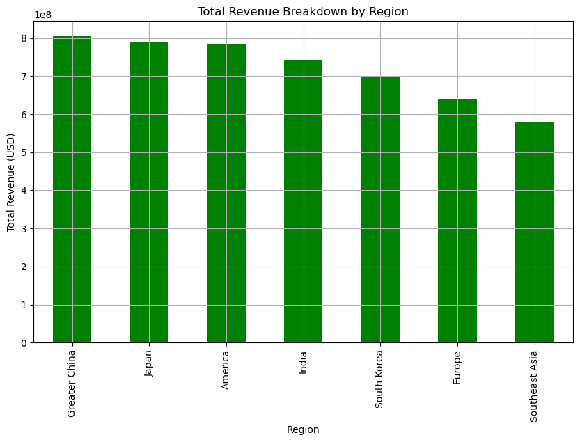
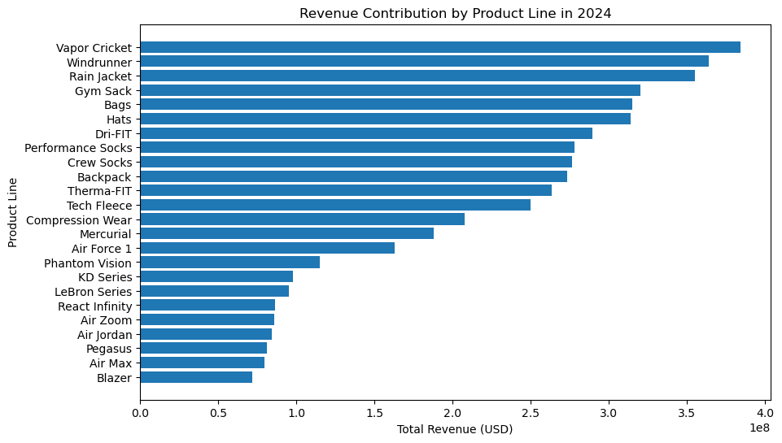
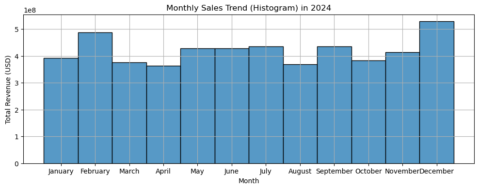
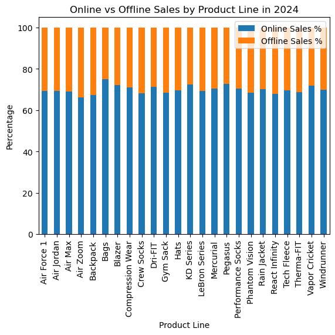

# **About the Data**
## Nike Global Sales Data Analysis (2024)
https://www.kaggle.com/datasets/ayushcx/nike-global-sales-data-2024
The dataset of Nike's global sales for the year 2024, spanning multiple regions, product categories, and price tiers.

## This dataset contains detailed monthly sales information, including:
Regions: Greater China, Japan, South Korea, India, Southeast Asia, America, Europe.  
Categories: Footwear, Apparel, and Equipment, with various sub-categories and product lines.  
Metrics: Units sold, revenue (USD), retail prices, and online sales percentages.

## Objectives: 
- Understand the structure of the dataset.
- Exploratory Data Analysis (EDA) to extract insights and trends (with graph)


# **Understand the data**  

To understand the dataset, we break down the analysis into the following key aspects:

1. Total Rows and Column
2. Check Data Type of Each Column
3. Summary of Numeric and Categorical Columns
4. Null Data Information
5. Display the First 10 Rows of the Dataset


```python
##import liabraries and package

import pandas as pd

import matplotlib.pyplot as plt
import seaborn as sns

```


```python
file_path = 'nike_sales_2024.csv'
sales = pd.read_csv(file_path)
```

## **1. Total Rows and Columns**  
- The dataset contains **1,000 rows** and **10 columns**.  
- Each row represents a **sales record** for a Nike product.


```python
## Total columns and rows

print("1. Total rows and columns")
print("there are ", sales.shape[0], "rows")
print("there are ", sales.shape[1], "columns")
```

    1. Total rows and columns
    there are  1000 rows
    there are  10 columns
    

## **2. Check Data Type of Each Column**  
- The dataset consists of **6 categorical** and **4 numerical** columns.  
- Categorical Columns: `Month`, `Region`, `Main_Category`, `Sub_Category`, `Product_Line`, `Price_Tier`  
- Numerical Columns: `Units_Sold`, `Revenue_USD`, `Online_Sales_Percentage`, `Retail_Price`  


```python
# Display data types of each column
print("2. Data Types of Each Column:")
print(sales.dtypes)
```

    2. Data Types of Each Column:
    Month                      object
    Region                     object
    Main_Category              object
    Sub_Category               object
    Product_Line               object
    Price_Tier                 object
    Units_Sold                  int64
    Revenue_USD                 int64
    Online_Sales_Percentage     int64
    Retail_Price                int64
    dtype: object
    

## **3. Summary of Numeric and Categorical Columns** 

#### **Categorical Columns:**
- **Month:** 12 unique values (e.g., January, February ... December). 
  - The most frequent month is **December** (96 occurrences).  
- **Region:** 7 unique regions.  
  - **Greater China** has the highest sales records (161 occurrences).  
- **Main Category:** 3 unique categories.  
  - **Equipment** appears the most (352 occurrences).  
- **Sub Category:** 11 unique values.  
  - **Outerwear** is the most frequent (125 occurrences).  
- **Product Line:** 24 unique product lines.  
  - **Windrunner** appears most frequently (65 occurrences).  
- **Price Tier:** 3 unique values.  
  - The majority of products fall under the **Budget** category (348 occurrences).  

#### **Numerical Columns:**
- **Units Sold:**
  - **Mean:** 28,498.95 units  
  - **Min:** 5,028 units  
  - **Max:** 49,992 units  

- **Revenue:**
  - **Mean:** 5,039,576.41  
  - **Min:** 287,400  
  - **Max:** 14,864,700

- **Online Sales Percentage:**
  - **Mean:** 70.04%  
  - **Min:** 60%  
  - **Max:** 90%  

- **Retail Price:**
  - **Mean:** \$176.32  
  - **Min:** \$50.00  
  - **Max:** \$300.00  


```python
## Display summary statistics for numeric and categorical columns

print("3. Summary Statistics:")
sales.describe(include ="all").round(2)
```

    3. Summary Statistics:
    


<div>
<style scoped>
    .dataframe tbody tr th:only-of-type {
        vertical-align: middle;
    }

    .dataframe tbody tr th {
        vertical-align: top;
    }

    .dataframe thead th {
        text-align: right;
    }
</style>
<table border="1" class="dataframe">
  <thead>
    <tr style="text-align: right;">
      <th></th>
      <th>Month</th>
      <th>Region</th>
      <th>Main_Category</th>
      <th>Sub_Category</th>
      <th>Product_Line</th>
      <th>Price_Tier</th>
      <th>Units_Sold</th>
      <th>Revenue_USD</th>
      <th>Online_Sales_Percentage</th>
      <th>Retail_Price</th>
    </tr>
  </thead>
  <tbody>
    <tr>
      <th>count</th>
      <td>1000</td>
      <td>1000</td>
      <td>1000</td>
      <td>1000</td>
      <td>1000</td>
      <td>1000</td>
      <td>1000.00</td>
      <td>1000.00</td>
      <td>1000.00</td>
      <td>1000.00</td>
    </tr>
    <tr>
      <th>unique</th>
      <td>12</td>
      <td>7</td>
      <td>3</td>
      <td>11</td>
      <td>24</td>
      <td>3</td>
      <td>NaN</td>
      <td>NaN</td>
      <td>NaN</td>
      <td>NaN</td>
    </tr>
    <tr>
      <th>top</th>
      <td>December</td>
      <td>Greater China</td>
      <td>Equipment</td>
      <td>Outerwear</td>
      <td>Windrunner</td>
      <td>Budget</td>
      <td>NaN</td>
      <td>NaN</td>
      <td>NaN</td>
      <td>NaN</td>
    </tr>
    <tr>
      <th>freq</th>
      <td>96</td>
      <td>161</td>
      <td>352</td>
      <td>125</td>
      <td>65</td>
      <td>348</td>
      <td>NaN</td>
      <td>NaN</td>
      <td>NaN</td>
      <td>NaN</td>
    </tr>
    <tr>
      <th>mean</th>
      <td>NaN</td>
      <td>NaN</td>
      <td>NaN</td>
      <td>NaN</td>
      <td>NaN</td>
      <td>NaN</td>
      <td>28498.95</td>
      <td>5039576.41</td>
      <td>70.04</td>
      <td>176.32</td>
    </tr>
    <tr>
      <th>std</th>
      <td>NaN</td>
      <td>NaN</td>
      <td>NaN</td>
      <td>NaN</td>
      <td>NaN</td>
      <td>NaN</td>
      <td>12926.50</td>
      <td>3267216.81</td>
      <td>11.75</td>
      <td>75.26</td>
    </tr>
    <tr>
      <th>min</th>
      <td>NaN</td>
      <td>NaN</td>
      <td>NaN</td>
      <td>NaN</td>
      <td>NaN</td>
      <td>NaN</td>
      <td>5028.00</td>
      <td>287400.00</td>
      <td>50.00</td>
      <td>50.00</td>
    </tr>
    <tr>
      <th>25%</th>
      <td>NaN</td>
      <td>NaN</td>
      <td>NaN</td>
      <td>NaN</td>
      <td>NaN</td>
      <td>NaN</td>
      <td>17554.25</td>
      <td>2344675.00</td>
      <td>60.00</td>
      <td>110.00</td>
    </tr>
    <tr>
      <th>50%</th>
      <td>NaN</td>
      <td>NaN</td>
      <td>NaN</td>
      <td>NaN</td>
      <td>NaN</td>
      <td>NaN</td>
      <td>28685.00</td>
      <td>4328020.00</td>
      <td>71.00</td>
      <td>180.00</td>
    </tr>
    <tr>
      <th>75%</th>
      <td>NaN</td>
      <td>NaN</td>
      <td>NaN</td>
      <td>NaN</td>
      <td>NaN</td>
      <td>NaN</td>
      <td>40026.00</td>
      <td>7264942.50</td>
      <td>80.00</td>
      <td>240.00</td>
    </tr>
    <tr>
      <th>max</th>
      <td>NaN</td>
      <td>NaN</td>
      <td>NaN</td>
      <td>NaN</td>
      <td>NaN</td>
      <td>NaN</td>
      <td>49992.00</td>
      <td>14864700.00</td>
      <td>90.00</td>
      <td>300.00</td>
    </tr>
  </tbody>
</table>
</div>


## **4. Null Data Information**  
- There is **no missing values** in the dataset.  


```python
## Print the summary of missing/null data

print("4. Print the summary about the Null Data information ")
sales.isna().sum()
```

    4. Print the summary about the Null Data information 
    


    Month                      0
    Region                     0
    Main_Category              0
    Sub_Category               0
    Product_Line               0
    Price_Tier                 0
    Units_Sold                 0
    Revenue_USD                0
    Online_Sales_Percentage    0
    Retail_Price               0
    dtype: int64


## **5. Display the First 10 Rows of the Dataset**  
(the first 10 rows of the dataset is shown as below:)


```python
## display the first 10 rows 

print("5. Display first 10th records")
sales.head(10)
```

    5. Display first 10th records
    


<div>
<style scoped>
    .dataframe tbody tr th:only-of-type {
        vertical-align: middle;
    }

    .dataframe tbody tr th {
        vertical-align: top;
    }

    .dataframe thead th {
        text-align: right;
    }
</style>
<table border="1" class="dataframe">
  <thead>
    <tr style="text-align: right;">
      <th></th>
      <th>Month</th>
      <th>Region</th>
      <th>Main_Category</th>
      <th>Sub_Category</th>
      <th>Product_Line</th>
      <th>Price_Tier</th>
      <th>Units_Sold</th>
      <th>Revenue_USD</th>
      <th>Online_Sales_Percentage</th>
      <th>Retail_Price</th>
    </tr>
  </thead>
  <tbody>
    <tr>
      <th>0</th>
      <td>November</td>
      <td>India</td>
      <td>Equipment</td>
      <td>Bags</td>
      <td>Gym Sack</td>
      <td>Budget</td>
      <td>48356</td>
      <td>14506800</td>
      <td>73</td>
      <td>300</td>
    </tr>
    <tr>
      <th>1</th>
      <td>January</td>
      <td>India</td>
      <td>Equipment</td>
      <td>Accessories</td>
      <td>Hats</td>
      <td>Budget</td>
      <td>9842</td>
      <td>2066820</td>
      <td>50</td>
      <td>210</td>
    </tr>
    <tr>
      <th>2</th>
      <td>October</td>
      <td>India</td>
      <td>Apparel</td>
      <td>Tops</td>
      <td>Tech Fleece</td>
      <td>Mid-Range</td>
      <td>25079</td>
      <td>1755530</td>
      <td>90</td>
      <td>70</td>
    </tr>
    <tr>
      <th>3</th>
      <td>December</td>
      <td>Greater China</td>
      <td>Footwear</td>
      <td>Cricket</td>
      <td>Vapor Cricket</td>
      <td>Premium</td>
      <td>41404</td>
      <td>8694840</td>
      <td>58</td>
      <td>210</td>
    </tr>
    <tr>
      <th>4</th>
      <td>May</td>
      <td>Greater China</td>
      <td>Equipment</td>
      <td>Socks</td>
      <td>Performance Socks</td>
      <td>Premium</td>
      <td>33569</td>
      <td>5371040</td>
      <td>53</td>
      <td>160</td>
    </tr>
    <tr>
      <th>5</th>
      <td>October</td>
      <td>Japan</td>
      <td>Apparel</td>
      <td>Performance</td>
      <td>Dri-FIT</td>
      <td>Premium</td>
      <td>39344</td>
      <td>5508160</td>
      <td>73</td>
      <td>140</td>
    </tr>
    <tr>
      <th>6</th>
      <td>December</td>
      <td>Japan</td>
      <td>Footwear</td>
      <td>Cricket</td>
      <td>Vapor Cricket</td>
      <td>Budget</td>
      <td>30197</td>
      <td>6945310</td>
      <td>50</td>
      <td>230</td>
    </tr>
    <tr>
      <th>7</th>
      <td>July</td>
      <td>Greater China</td>
      <td>Apparel</td>
      <td>Tops</td>
      <td>Therma-FIT</td>
      <td>Mid-Range</td>
      <td>42814</td>
      <td>6422100</td>
      <td>55</td>
      <td>150</td>
    </tr>
    <tr>
      <th>8</th>
      <td>April</td>
      <td>Greater China</td>
      <td>Footwear</td>
      <td>Cricket</td>
      <td>Vapor Cricket</td>
      <td>Mid-Range</td>
      <td>16489</td>
      <td>2473350</td>
      <td>78</td>
      <td>150</td>
    </tr>
    <tr>
      <th>9</th>
      <td>February</td>
      <td>Europe</td>
      <td>Footwear</td>
      <td>Cricket</td>
      <td>Vapor Cricket</td>
      <td>Mid-Range</td>
      <td>43626</td>
      <td>10033980</td>
      <td>86</td>
      <td>230</td>
    </tr>
  </tbody>
</table>
</div>


# **Exploratory Data Analysis (EDA)** 

We further analyze the dataset to extract key insights:

1. Total Revenue Breakdown by Region
2. Total Revenue Breakdown by Region & Main Category
3. Revenue Contribution by Product Line (Bar Chart)
4. Monthly Sales Trend (Histogram)
5. Online vs Offline Sales by Product Line (Stacked Bar Chart)

## **1. Total Revenue Breakdown by Region**  
To understand which regions contribute the most revenue, we summarize total revenue per region.  
### **Revenue Breakdown by Region:**  

**Greater China:** \$804,543,630  
**Japan:** \$788,236,410  
**America:** \$784,640,550  
**India:** \$743,029,330  
**South Korea:** \$699,019,260  
**Europe:** \$639,991,140  
**Southeast Asia:** \$580,116,090  

### **Finding**:  
**Greater China** generates the highest revenue, making it the most sales in 2024.  
**Japan** and **America** follow closely, indicating strong market performance.  
**Southeast Asia** has the lowest revenue among the regions, suggesting to review the sales strategies in this market.  


```python
## Total Revenue Breakdown by Region (in list)

print("1. Total Revenue Breakdown by Region")

sales.groupby(["Region"])["Revenue_USD"].sum().sort_values(ascending=False)
```

    1. Total Revenue Breakdown by Region
    


    Region
    Greater China     804543630
    Japan             788236410
    America           784640550
    India             743029330
    South Korea       699019260
    Europe            639991140
    Southeast Asia    580116090
    Name: Revenue_USD, dtype: int64


```python
## Total Revenue Breakdown by Region (in bar chart)
region_revenue = sales.groupby("Region")["Revenue_USD"].sum().sort_values(ascending=False)

# Create a bar chart
plt.figure(figsize=(10, 6))
region_revenue.plot(kind='bar', color='green')

# Customize chart labels and title
plt.xlabel("Region")
plt.ylabel("Total Revenue (USD)")
plt.title("Total Revenue Breakdown by Region")
plt.grid()

# Show the chart
plt.show()
```


    

    


## **2. Total Revenue Breakdown by Region & Main Category**  
Breaking down revenue by **region and main category** (Footwear, Apparel, Equipment) to provide a deeper insights.

### **Revenue Breakdown (in list format):**  

- **America**  
  - Apparel: \$305,061,420  
  - Equipment: \$261,674,350  
  - Footwear: \$217,904,780

- **Europe**  
  - Apparel: \$240,167,660  
  - Equipment: \$233,883,810  
  - Footwear: \$165,939,670  

- **Greater China**  
  - Apparel: \$276,664,300  
  - Equipment: \$256,326,320  
  - Footwear: \$271,553,010

- **India**  
  - Apparel: \$225,827,310  
  - Equipment: \$307,899,180  
  - Footwear: \$209,302,840

- **Japan**  
  - Apparel: \$284,178,690  
  - Equipment: \$221,000,280  
  - Footwear: \$283,057,440  

- **South Korea**  
  - Apparel: \$242,974,880 
  - Equipment: \$278,156,310  
  - Footwear: \$177,888,070  

- **Southeast Asia**  
  - Apparel: \$154,201,860 
  - Equipment: \$218,385,140  
  - Footwear: \$207,529,090
    
### **Findings:**  
- **Apparel** is the highest revenue-generating category in most regions.
- **America** leads in **Apparel** sales (305M), making it a key market for Nike’s clothing category
- **India** records the highest revenue in **Equipment** sales, indicating strong demand for sports gear
- **Footwear** performs exceptionally well in **Japan** (\$283K>) and **Greater China** (\$271K>), whereas **Europe** reports the lowest sales at just $166K


```python
## Total Revenue Breakdown by Region & main_category (in list)

print("2.Total Revenue Breakdown by Region & main_category")

pivot_Region_mainCategory = pd.pivot_table(sales, index=["Region", "Main_Category"], values= ["Revenue_USD"], aggfunc='sum')

## display table
pivot_Region_mainCategory
```

    2.Total Revenue Breakdown by Region & main_category
    


<div>
<style scoped>
    .dataframe tbody tr th:only-of-type {
        vertical-align: middle;
    }

    .dataframe tbody tr th {
        vertical-align: top;
    }

    .dataframe thead th {
        text-align: right;
    }
</style>
<table border="1" class="dataframe">
  <thead>
    <tr style="text-align: right;">
      <th></th>
      <th></th>
      <th>Revenue_USD</th>
    </tr>
    <tr>
      <th>Region</th>
      <th>Main_Category</th>
      <th></th>
    </tr>
  </thead>
  <tbody>
    <tr>
      <th rowspan="3" valign="top">America</th>
      <th>Apparel</th>
      <td>305061420</td>
    </tr>
    <tr>
      <th>Equipment</th>
      <td>261674350</td>
    </tr>
    <tr>
      <th>Footwear</th>
      <td>217904780</td>
    </tr>
    <tr>
      <th rowspan="3" valign="top">Europe</th>
      <th>Apparel</th>
      <td>240167660</td>
    </tr>
    <tr>
      <th>Equipment</th>
      <td>233883810</td>
    </tr>
    <tr>
      <th>Footwear</th>
      <td>165939670</td>
    </tr>
    <tr>
      <th rowspan="3" valign="top">Greater China</th>
      <th>Apparel</th>
      <td>276664300</td>
    </tr>
    <tr>
      <th>Equipment</th>
      <td>256326320</td>
    </tr>
    <tr>
      <th>Footwear</th>
      <td>271553010</td>
    </tr>
    <tr>
      <th rowspan="3" valign="top">India</th>
      <th>Apparel</th>
      <td>225827310</td>
    </tr>
    <tr>
      <th>Equipment</th>
      <td>307899180</td>
    </tr>
    <tr>
      <th>Footwear</th>
      <td>209302840</td>
    </tr>
    <tr>
      <th rowspan="3" valign="top">Japan</th>
      <th>Apparel</th>
      <td>284178690</td>
    </tr>
    <tr>
      <th>Equipment</th>
      <td>221000280</td>
    </tr>
    <tr>
      <th>Footwear</th>
      <td>283057440</td>
    </tr>
    <tr>
      <th rowspan="3" valign="top">South Korea</th>
      <th>Apparel</th>
      <td>242974880</td>
    </tr>
    <tr>
      <th>Equipment</th>
      <td>278156310</td>
    </tr>
    <tr>
      <th>Footwear</th>
      <td>177888070</td>
    </tr>
    <tr>
      <th rowspan="3" valign="top">Southeast Asia</th>
      <th>Apparel</th>
      <td>154201860</td>
    </tr>
    <tr>
      <th>Equipment</th>
      <td>218385140</td>
    </tr>
    <tr>
      <th>Footwear</th>
      <td>207529090</td>
    </tr>
  </tbody>
</table>
</div>


## **3. Revenue Contribution by Product Line (Bar Chart)**  
We analyze revenue contributions by product line to identify top-performing categories.

### **Bar Chart Representation:**  
*(Bar chart visualization goes here in the notebook.)*  


```python
##Revenue Contribution by Product Line (Bar Chart using plt.bar)

print("3. Revenue Contribution by product line (bar chart)")

product_line_revenue = sales.groupby("Product_Line")["Revenue_USD"].sum().reset_index().sort_values(by="Revenue_USD", ascending=True)

plt.figure(figsize=(10,6))
plt.barh(product_line_revenue["Product_Line"], product_line_revenue["Revenue_USD"],)
plt.xlabel("Total Revenue (USD)")
plt.ylabel("Product Line")
plt.title("Revenue Contribution by Product Line in 2024")
plt.show()

```

    3. Revenue Contribution by product line (bar chart)
    


    

    


### **Findings:**  
- **Vapor Cricket** and **Windrunner** are the top-performing product lines, generating the highest revenue, indicating strong customer demand.
- **Rain Jacket, Gym Sack, and Bags** also contribute significantly to total revenue, demonstrating their popularity in the market.
- Lower-performing product lines, e.g. **Pegasus, Air Max, Blazer** should be assessed to improve sales.


## **4. Monthly Sales Trend (Histogram)**  

We analyze sales trends across months to see seasonal patterns.

### **Histogram Representation:**  
*(Histogram visualization goes here in the notebook.)*


```python
## Monthly Sales Trend (histogram)

print("4. Monthly Sales Trend (histogram)")

## Rearrange "month" in the correct order
months_order = ["January", "February", "March", "April", "May", "June", "July", "August", "September", "October", "November", "December"]
sales["Month"] = pd.Categorical(sales["Month"], categories=months_order, ordered=True)

plt.figure(figsize=(12,4))
sns.histplot(data=sales, x="Month", weights="Revenue_USD")
plt.xlabel("Month")
plt.ylabel("Total Revenue (USD)")
plt.title("Monthly Sales Trend (Histogram) in 2024")
plt.grid()
plt.show()

```

    4. Monthly Sales Trend (histogram)
    


    

    


### **Findings:**  
- **December** has the highest sales volume, likely due to seasonal shopping and promotions.  
- Sales drop in **March, April, and August**, indicating a seasonal lull that requires marketing interventions.
- Summer months **June to August** tend to have moderate sales, suggesting an opportunity for mid-year sales events or back-to-school campaigns to bosst sales 

## **5. Online vs Offline Sales by Product line (Stacked Bar Chart)**

**Stacked Bar Chart Representation:** 

*(Stacked bar chart visualization goes here in the notebook.)*


```python
## online vs offline Sales by Product line (Stacked Bar Chart)

print ("5. online vs offline Sales by Product Line (Stacked Bar Chart)")

## Add a new column to store Offline Sales Percentage
sales["Offline_Sales_Percentage"] = 100 - sales["Online_Sales_Percentage"]

# Average percentage of online and offline sales per region
online_offline_sales = sales.groupby("Product_Line")[["Online_Sales_Percentage", "Offline_Sales_Percentage"]].mean() 

plt.figure(figsize=(12,6))
online_offline_sales.plot(kind="bar", stacked=True)
plt.xlabel("Product Line")
plt.ylabel("Percentage")
plt.title("Online vs Offline Sales by Product Line in 2024")
plt.legend(["Online Sales %", "Offline Sales %"])
plt.show()

```

    5. online vs offline Sales by Product Line (Stacked Bar Chart)
    


    <Figure size 1200x600 with 0 Axes>


    

    


### **Findings:**  

- **Air Zoom** has the highest offline sales percentage (33.88%), suggesting that customers prefer in-store purchases for this product, possibly due to the need for in-person trials before buying
- **Bags, Pegasus**, and **KD Series** have the highest online sales percentages, with more than 72% of purchases occurring online, indicating strong digital demand.
- Products like **Backpacks and Air Max** maintain a balanced online and offline distribution, reflecting steady sales across both channels
- Footwear models tend to perform better online, while accessories such as Backpacks see a higher proportion of offline sales, likely due to impulse buying behavior in retail stores
